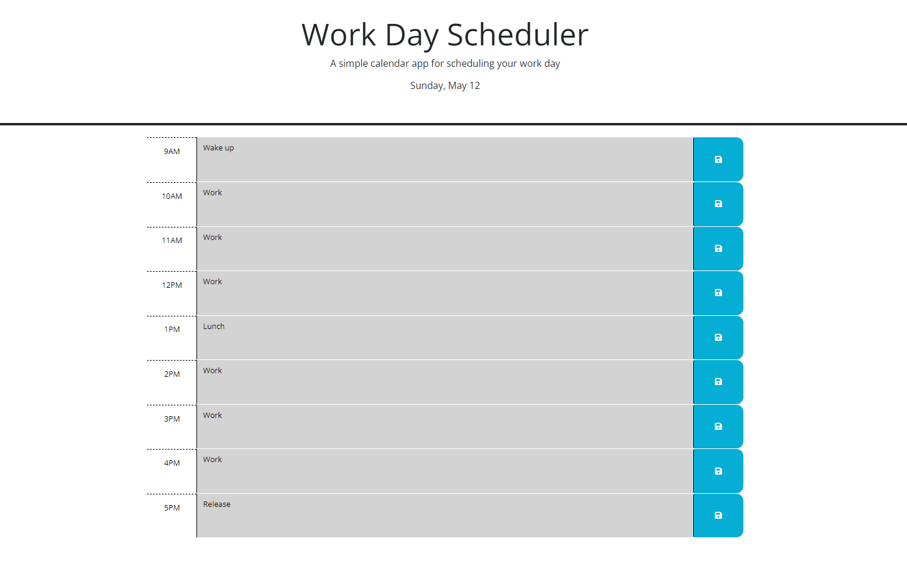

# Work Day Scheduler

    A simple calendar app for scheduling your work day.

# Description

    This project is a work day scheduler that allows users to plan their activities for each hour of the work day from 9 AM to 5 PM. The scheduler provides a clean and intuitive interface for users to input their tasks and save them for future reference.

# Features

    Displays time blocks for each hour of the work day (9 AM to 5 PM).
    Allows users to input tasks for each hour.
    Saves user input to local storage for persistence.
    Dynamically updates time block colors based on the current hour (past, present, future).
    Provides an aesthetically pleasing and responsive design.
    Technologies Used
    HTML5
    CSS3 (Bootstrap 5.1.3)
    JavaScript (jQuery, Day.js)
    

# Usage

    Open the index.html file in a web browser.
    Input your tasks for each hour of the work day.
    Click the save button to save your tasks.
    Tasks will be saved locally and displayed when you revisit the page.
    Time block colors will dynamically update based on the current hour.

# Deployment

    The project can be deployed to any static web hosting service, such as GitHub Pages, Netlify, or Vercel. Simply upload the project files to your hosting provider and ensure that the index.html file is set as the default entry point.

# Known Issues

    Please tell me

# License

This project is licensed under the MIT License.
